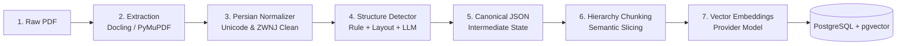
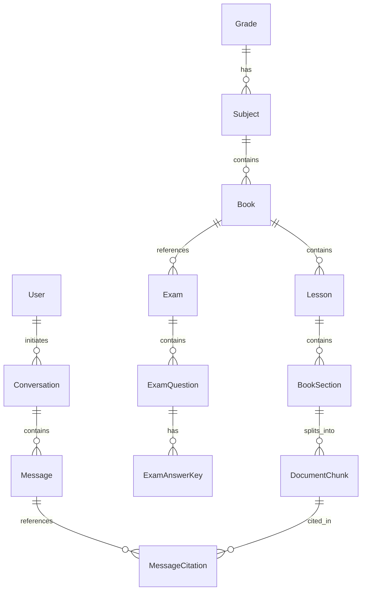
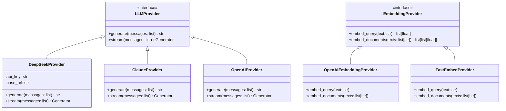

# 🎓 AI High School Tutor: Architecture, Strategy & Master Blueprint
### A Production-Grade, Curriculum-Grounded RAG System for the Iranian High School Educational System

---

## 📑 Table of Contents
1. [Executive Summary & Vision](#1-executive-summary--vision)
2. [Problem Statement & Educational Context](#2-problem-statement--educational-context)
3. [The Moat: Competitive Advantages & Defensibility](#3-the-moat-competitive-advantages--defensibility)
4. [MVP Scope & Strategic Focus](#4-mvp-scope--strategic-focus)
5. [End-to-End System Architecture](#5-end-to-end-system-architecture)
6. [Document Ingestion Pipeline (PDF to Canonical Knowledge)](#6-document-ingestion-pipeline-pdf-to-canonical-knowledge)
7. [Database Architecture & Data Schemas (PostgreSQL + pgvector)](#7-database-architecture--data-schemas-postgresql--pgvector)
8. [Advanced Retrieval Engine & Search Evolution](#8-advanced-retrieval-engine--search-evolution)
9. [AI Provider & Gateway Abstraction Layer](#9-ai-provider--gateway-abstraction-layer)
10. [Subject-Specific Pedagogical Prompting Framework](#10-subject-specific-pedagogical-prompting-framework)
11. [Frontend Experience & User Interface Design](#11-frontend-experience--user-interface-design)
12. [Business Model, Hypotheses & Validation Protocol](#12-business-model-hypotheses--validation-protocol)
13. [Phased Implementation Roadmap](#13-phased-implementation-roadmap)
14. [KPIs, Quality Benchmarking & Observability](#14-kpis-quality-benchmarking--observability)

---

## 1. Executive Summary & Vision

The objective of this project is to build an **intelligent, specialized AI Tutor and learning companion tailored specifically to the Iranian High School curriculum (متوسطه دوم - Grades 10, 11, and 12)**.

Unlike generic chatbot wrappers that query external LLMs directly, this platform acts as an **authoritative pedagogical companion**. It bridges the gap between high-school students and official educational resources:
- **Strictly Grounded:** Answers are strictly grounded in official textbooks published by the Ministry of Education (سازمان پژوهش و برنامه‌ریزی آموزشی) and official nationwide Final Examinations (امتحانات نهایی).
- **Pedagogically Aligned:** Explanations adopt the tone, terminology, and step-by-step methodologies used by top Iranian educators.
- **Transparent & Trustworthy:** Every single factual claim or concept is backed by verified citations (Book, Lesson, Section, Page Number).
- **Exam-Intelligent:** The platform understands how topics have historically appeared in nationwide final exams, the official grading rubrics (کلید تصحیح / بارم‌بندی), and common conceptual traps.

---

## 2. Problem Statement & Educational Context

### 2.1 The High Stakes of Iranian High School Education
In the modern Iranian educational landscape, the **Final National Examinations (امتحانات نهایی)** in Grade 12 (and increasingly Grades 10 & 11) directly impact university entrance (Konkur / کنکور) through substantial direct GPA quotas (تاثیر قطعی سوابق تحصیلی). 

Every fractional grade point matters. In national exam grading:
- Grading keys are **rigid and literal**. Evaluators grade papers against exact keywords and definitions found in the official textbook.
- Paraphrasing with generic or colloquial synonyms often results in point deductions.
- Memorization alone is insufficient; students must grasp cross-lesson connections (e.g., connecting a Quranic verse in Lesson 2 with a theological concept in Lesson 6).

### 2.2 Why Generic LLMs Fail
When an Iranian student queries a raw, out-of-the-box model (ChatGPT, DeepSeek, Claude, Gemini):
1. **Curriculum Blindness:** The model does not know the exact curriculum edition for the 1404–1405 academic year, nor does it distinguish between Science (تجربی), Mathematics (ریاضی), and Humanities (انسانی) textbook variations.
2. **Hallucinated Terminology:** It provides generic dictionary definitions rather than the exact textbook terminology evaluated on exams.
3. **Absence of Citations:** Students cannot verify where an explanation originates in their textbook, breeding skepticism or leading to academic misdirection.
4. **Lack of Examination Context:** Generic models cannot indicate whether a specific section has appeared in past exam cycles, its typical point weight, or how it is structured in descriptive questions.

```
┌────────────────────────────────────────────────────────────────────────┐
│                        The Naive LLM Approach                          │
│                                                                        │
│   Student ────> [ Generic LLM ] ────> Generic / Unverified Answer      │
│                  (No Context)         (Risk of hallucination & error)  │
└────────────────────────────────────────────────────────────────────────┘

┌────────────────────────────────────────────────────────────────────────┐
│                      Our Specialized RAG Engine                        │
│                                                                        │
│   Student ────> [ Question Router & Classifier ]                       │
│                        │                                               │
│                        ▼                                               │
│                 [ Hybrid Search ]                                      │
│              (pgvector + Full-Text FTS)                                │
│                        │                                               │
│       ┌────────────────┴────────────────┐                              │
│       ▼                                 ▼                              │
│  Textbook Knowledge             Final Exam Archive                     │
│  (Grade/Lesson/Page)           (Questions/Rubrics)                     │
│       │                                 │                              │
│       └────────────────┬────────────────┘                              │
│                        ▼                                               │
│             [ Reranker & Context Builder ]                             │
│                        ▼                                               │
│            [ DeepSeek API + Pedagogy ]                                 │
│                        ▼                                               │
│     Grounded Answer + Official Citations + Exam Insights               │
└────────────────────────────────────────────────────────────────────────┘
```

---

## 3. The Moat: Competitive Advantages & Defensibility

The core competitive advantage (the "Moat") of this product does **not** reside in the underlying Foundation Model. Models like DeepSeek, GPT-4o, or Claude 3.5 Sonnet are interchangeable commodities.

The true defensibility is built across four core pillars:

```
                            THE PRODUCT MOAT
                                   │
      ┌─────────────────┬──────────┴──────────┬─────────────────┐
      ▼                 ▼                     ▼                 ▼
 1. Structured    2. Hierarchy-Aware    3. Pedagogical     4. Student Mastery
 Educational      Retrieval &           Prompting &        Knowledge Graph
 Knowledge Base   pgvector Filtering    Citations          (Personalization)
```

### 1. Structured Educational Knowledge Base
- Complete decomposition of official textbooks into hierarchical entities (Book $\to$ Lesson $\to$ Section $\to$ Verses / Activities / Figures $\to$ Pages).
- Multi-year database of nationwide Final Examinations (1400–1404 Khordad, Shahrivar, Dey) with itemized question numbers, associated point values, topic tags, and official marking schemes.

### 2. Hierarchy-Aware Retrieval with Strict Filtering
- Metadata tagging enables targeted retrieval. If a student asks a question within "12th Grade Religious Studies, Lesson 6", retrieval searches **only** that subspace rather than drowning in millions of irrelevant chunks.

### 3. Subject-Specific Pedagogical Prompting
- Custom prompting frameworks for each subject:
  - **Religious Studies (دین و زندگی):** Verse-to-message mapping, official definitions, descriptive response formatting.
  - **Persian Literature (ادبیات فارسی):** Verse paraphrasing, poetic devices (آرایه‌های ادبی), grammatical breakdown (دستور زبان).
  - **Mathematics & Physics (ریاضی و فیزیک):** Step-by-step analytical derivation, identifying given/unknown variables, formula verification.

### 4. Grounded Citations & Verifiability
- Transparent referencing of page numbers and lessons, accompanied by interactive popovers displaying the verbatim textbook text to build complete student trust.

### 5. Exam Intelligence & Student Modeling
- Frequency analysis of exam topics to guide student prioritization.
- Long-term student profiling tracking individual conceptual mastery and diagnosing specific weaknesses.

---

## 4. MVP Scope & Strategic Focus

To validate the core value proposition rapidly and eliminate architectural risks, the MVP focuses on a single, high-impact subject before expanding.

### 4.1 Target Subject: Din va Zendegi 3 (دین و زندگی ۳ - Grade 12)
* **Target Audience:** Grade 12 students in the Experimental Sciences (تجربی) and Mathematical Sciences (ریاضی) branches.
* **Why this subject?**
  1. Highly text-centric and deterministic (easy to measure retrieval precision and ground truth).
  2. Heavy reliance on exact textbook wording for national exams.
  3. High student anxiety regarding verse meanings (آیات), core themes (پیام آیات), and inter-lesson concepts.
  4. Immediate testing feedback loop against past exam question keys.

### 4.2 Core Deliverables for the MVP
1. **Robust Ingestion Pipeline:** Automated ingestion of `dini12.pdf` producing clean, structured canonical JSON and database records without manual data entry.
2. **PostgreSQL + pgvector Storage:** Unified relational schema storing curriculum structure alongside vector embeddings.
3. **Core RAG Engine:** Query embedding $\to$ similarity search $\to$ prompt synthesis $\to$ DeepSeek generation with verbatim citations.
4. **Interactive Chat Interface:** Modern, clean streaming web UI with breadcrumb lesson navigation and source inspection.
5. **Quality Benchmark Suite:** Evaluation of 50 real student questions to verify recall@5 ($>90\%$), citation accuracy ($100\%$), and zero ungrounded hallucinations.

---

## 5. End-to-End System Architecture

The system is designed as a modular, layered architecture emphasizing clean separation of concerns, rapid prototyping, and high operational reliability.

```mermaid
flowchart TB
    subgraph Client["Frontend Layer (Next.js / React)"]
        UI[Chat Interface / assistant-ui / shadcn]
        Nav[Curriculum Breadcrumbs / Subject & Lesson Picker]
        SourceView[Citation & Textbook Preview Modal]
    end

    subgraph API["Backend Service Layer (Django + DRF)"]
        Router[API Endpoints / REST]
        StreamHandler[SSE Streaming Response Handler]
        ChatSvc[Conversation & Session Service]
        RAGSvc[RAG Orchestration Engine]
        IngestSvc[Ingestion & Processing Pipeline]
    end

    subgraph Engine["AI & Retrieval Engines"]
        Classifier[Query Intent & Scope Classifier]
        EmbedSvc[Embedding Provider Service]
        pgvSearch[pgvector Semantic Cosine Search]
        ftsSearch[PostgreSQL Full-Text Search - BM25]
        Fusion[Reciprocal Rank Fusion - RRF]
        Reranker[Cross-Encoder Reranker]
        LLMSvc[LLM Provider: DeepSeek API]
    end

    subgraph Data["Database & Storage Layer (PostgreSQL 15+)"]
        Relational[(Users / Roles / Sessions)]
        CurriculumDB[(Grades / Subjects / Books / Lessons)]
        VectorDB[(DocumentChunks + pgvector 1024/1536 dim)]
        ExamDB[(Exams / Questions / Answer Keys)]
    end

    UI -->|1. User Prompt (SSE/REST)| Router
    Router --> StreamHandler
    StreamHandler --> ChatSvc
    ChatSvc --> RAGSvc
    
    RAGSvc -->|A. Classify Query| Classifier
    RAGSvc -->|B. Generate Embedding| EmbedSvc
    EmbedSvc -->|Query Vector| pgvSearch
    
    pgvSearch -->|Semantic Candidates| VectorDB
    ftsSearch -->|Keyword Candidates| VectorDB
    
    pgvSearch & ftsSearch --> Fusion
    Fusion --> Reranker
    Reranker -->|Top 5 Relevant Chunks| RAGSvc
    
    RAGSvc -->|C. Build Pedagogical Prompt| LLMSvc
    LLMSvc -->|D. Stream Generated Tokens| StreamHandler
    StreamHandler -->|E. Realtime SSE Stream| UI
    
    IngestSvc --> CurriculumDB & VectorDB & ExamDB
```

---

## 6. Document Ingestion Pipeline (PDF to Canonical Knowledge)

Converting complex Persian educational PDFs into machine-readable, hierarchy-aware chunks is the foundational challenge of the system. 



### 6.1 Multi-Stage Pipeline Breakdown

#### Stage 1: Document Extraction & Layout Analysis
- Utilizes **Docling** for deep layout parsing (detecting headings, paragraphs, tables, images, and coordinate bounds) with **PyMuPDF (fitz)** as a high-speed fallback.
- **Rule of Invariance:** Page boundaries must never be merged or lost; every text block retains its exact physical page index for citation integrity.

#### Stage 2: Persian Text Normalization
- Converts Arabic characters to standard Persian (`ي` $\to$ `ی`, `ك` $\to$ `ک`, `ة` $\to$ `ه`).
- Standardizes Zero-Width Non-Joiner (ZWNJ / نیم‌فاصله) usage in prefixes and suffixes (`می‌شود`, `دانش‌آموزان`).
- Strips recurring running headers, footers, publisher watermarks, and page numbers that pollute semantic representations.
- Preserves both `raw_text` and `normalized_text` for provenance tracking.

#### Stage 3: Educational Structure Detection (Hybrid Engine)
- **Rule-Based Engine:** Detects clear lexical patterns:
  - Lesson titles: `درس [اول|دوم|...|دوازدهم]`, `درس \d+`
  - Section headers: `تفکر در آیات`, `بررسی`, `اندیشه و تحقیق`, `پیشنهاد`, `فعالیت کلاسی`
- **Layout Heuristics:** Detects font sizes, bold weights, center-alignments, and callout box borders.
- **LLM Fallback:** For ambiguous sections or multi-page continuations, a targeted LLM prompt categorizes the block into the formal taxonomy.

#### Stage 4: Canonical Intermediate Document Schema
Before chunking or database insertion, all parsed data is transformed into a standardized, versioned JSON schema.

```json
{
  "schema_version": "1.0.0",
  "document_type": "textbook",
  "metadata": {
    "grade": 12,
    "field": "experimental_and_mathematics",
    "subject": "دین و زندگی",
    "book_title": "دین و زندگی ۳",
    "academic_year": "1404-1405",
    "total_pages": 142
  },
  "lessons": [
    {
      "lesson_number": 1,
      "lesson_title": "هستی‌بخش",
      "page_start": 8,
      "page_end": 20,
      "sections": [
        {
          "section_id": "sec-12-dini-l1-s1",
          "section_type": "verse_reflection",
          "section_title": "تفکر در آیات",
          "page_start": 10,
          "page_end": 11,
          "content": "متن تفکر در آیات...",
          "verses": [
            {
              "surah": "فاطر",
              "ayah": 15,
              "arabic_text": "يَا أَيُّهَا النَّاسُ أَنْتُمُ الْفُقَرَاءُ إِلَى اللَّهِ...",
              "translation": "ای مردم، شما همگی به خداوند نیازمندید..."
            }
          ],
          "exercises": []
        }
      ]
    }
  ]
}
```

#### Stage 5: Hierarchy-Aware Semantic Chunking
- Standard token-count chunkers produce broken sentences and split context (e.g., cutting a Quranic verse in half or separating a question from its subtext).
- **Our Policy:** Chunks strictly obey semantic boundaries:
  - If a section is $< 600$ tokens: kept as 1 cohesive chunk.
  - If a section is $> 600$ tokens: split at paragraph boundaries with a 100-token sliding window overlap.
  - Chunks inherit complete hierarchical metadata (Grade, Subject, Lesson, Section, Page Range).

#### Stage 6: Vector Embedding & Storage
- Chunks are vectorized using a high-performance Persian-compatible embedding model and indexed in PostgreSQL using **HNSW** on `pgvector`.

---

## 7. Database Architecture & Data Schemas (PostgreSQL + pgvector)

Using PostgreSQL with `pgvector` enables holding transactional application state, relational metadata, and vector embeddings in a single ACID-compliant database.



### 7.1 Relational & Vector SQL Schema

```sql
-- Enable required extensions
CREATE EXTENSION IF NOT EXISTS "uuid-ossp";
CREATE EXTENSION IF NOT EXISTS "vector";
CREATE EXTENSION IF NOT EXISTS "pg_trgm";

-- 1. Curriculum Hierarchy
CREATE TABLE grades (
    id SERIAL PRIMARY KEY,
    name VARCHAR(50) NOT NULL, -- e.g., 'دوازدهم'
    code INT NOT NULL UNIQUE   -- e.g., 12
);

CREATE TABLE fields_of_study (
    id SERIAL PRIMARY KEY,
    name VARCHAR(100) NOT NULL, -- e.g., 'علوم تجربی'
    slug VARCHAR(50) NOT NULL UNIQUE
);

CREATE TABLE subjects (
    id SERIAL PRIMARY KEY,
    name VARCHAR(100) NOT NULL, -- e.g., 'دین و زندگی'
    slug VARCHAR(50) NOT NULL UNIQUE
);

CREATE TABLE books (
    id SERIAL PRIMARY KEY,
    grade_id INT NOT NULL REFERENCES grades(id) ON DELETE CASCADE,
    field_id INT NOT NULL REFERENCES fields_of_study(id) ON DELETE CASCADE,
    subject_id INT NOT NULL REFERENCES subjects(id) ON DELETE CASCADE,
    title VARCHAR(200) NOT NULL,
    academic_year VARCHAR(20) NOT NULL, -- '1404-1405'
    source_pdf_path TEXT,
    created_at TIMESTAMP WITH TIME ZONE DEFAULT NOW()
);

CREATE TABLE lessons (
    id SERIAL PRIMARY KEY,
    book_id INT NOT NULL REFERENCES books(id) ON DELETE CASCADE,
    lesson_number INT NOT NULL,
    title VARCHAR(250) NOT NULL,
    page_start INT NOT NULL,
    page_end INT NOT NULL,
    summary TEXT,
    UNIQUE(book_id, lesson_number)
);

CREATE TABLE book_sections (
    id SERIAL PRIMARY KEY,
    lesson_id INT NOT NULL REFERENCES lessons(id) ON DELETE CASCADE,
    section_type VARCHAR(50) NOT NULL, -- 'main_text', 'verse_reflection', 'activity', 'questions'
    title VARCHAR(250),
    page_start INT NOT NULL,
    page_end INT NOT NULL,
    raw_content TEXT NOT NULL
);

-- 2. Document Chunks & Vector Store
CREATE TABLE document_chunks (
    id BIGSERIAL PRIMARY KEY,
    section_id INT NOT NULL REFERENCES book_sections(id) ON DELETE CASCADE,
    lesson_id INT NOT NULL REFERENCES lessons(id) ON DELETE CASCADE,
    book_id INT NOT NULL REFERENCES books(id) ON DELETE CASCADE,
    
    chunk_index INT NOT NULL,
    original_content TEXT NOT NULL,
    contextual_content TEXT, -- Anthropic contextual retrieval enriched text
    
    page_start INT NOT NULL,
    page_end INT NOT NULL,
    token_count INT NOT NULL,
    
    metadata JSONB NOT NULL DEFAULT '{}'::jsonb,
    embedding vector(1024), -- Dimensions matching selected embedding model
    
    tsv_content tsvector GENERATED ALWAYS AS (to_tsvector('simple', original_content)) STORED,
    created_at TIMESTAMP WITH TIME ZONE DEFAULT NOW()
);

-- 3. HNSW Vector Index & Full-Text Search Indexes
CREATE INDEX idx_chunks_embedding_hnsw 
ON document_chunks 
USING hnsw (embedding vector_cosine_ops)
WITH (m = 16, ef_construction = 64);

CREATE INDEX idx_chunks_tsv ON document_chunks USING gin (tsv_content);
CREATE INDEX idx_chunks_metadata ON document_chunks USING gin (metadata);
CREATE INDEX idx_chunks_lookup ON document_chunks (book_id, lesson_id, page_start);

-- 4. Nationwide Final Exams Bank
CREATE TABLE exams (
    id SERIAL PRIMARY KEY,
    book_id INT NOT NULL REFERENCES books(id) ON DELETE CASCADE,
    academic_year VARCHAR(20) NOT NULL, -- '1403'
    term VARCHAR(30) NOT NULL,          -- 'khordad', 'shahrivar', 'dey'
    exam_date DATE,
    total_score NUMERIC(4,2) DEFAULT 20.00
);

CREATE TABLE exam_questions (
    id SERIAL PRIMARY KEY,
    exam_id INT NOT NULL REFERENCES exams(id) ON DELETE CASCADE,
    lesson_id INT REFERENCES lessons(id) ON DELETE SET NULL,
    question_number INT NOT NULL,
    question_text TEXT NOT NULL,
    score NUMERIC(4,2) NOT NULL,
    topic_tags TEXT[],
    embedding vector(1024)
);

CREATE TABLE exam_answer_keys (
    id SERIAL PRIMARY KEY,
    question_id INT NOT NULL REFERENCES exam_questions(id) ON DELETE CASCADE,
    official_answer TEXT NOT NULL,
    rubric_breakdown JSONB NOT NULL DEFAULT '[]'::jsonb -- [{part: 'الف', text: '...', score: 0.5}]
);

-- 5. Chat History & Grounded Citations
CREATE TABLE conversations (
    id UUID PRIMARY KEY DEFAULT uuid_generate_v4(),
    user_id BIGINT,
    book_id INT REFERENCES books(id),
    title VARCHAR(255) DEFAULT 'گفتگوی جدید',
    created_at TIMESTAMP WITH TIME ZONE DEFAULT NOW(),
    updated_at TIMESTAMP WITH TIME ZONE DEFAULT NOW()
);

CREATE TABLE messages (
    id UUID PRIMARY KEY DEFAULT uuid_generate_v4(),
    conversation_id UUID NOT NULL REFERENCES conversations(id) ON DELETE CASCADE,
    role VARCHAR(20) NOT NULL, -- 'user', 'assistant', 'system'
    content TEXT NOT NULL,
    intent_detected VARCHAR(50),
    tokens_used INT DEFAULT 0,
    created_at TIMESTAMP WITH TIME ZONE DEFAULT NOW()
);

CREATE TABLE message_citations (
    id SERIAL PRIMARY KEY,
    message_id UUID NOT NULL REFERENCES messages(id) ON DELETE CASCADE,
    chunk_id BIGINT NOT NULL REFERENCES document_chunks(id) ON DELETE CASCADE,
    lesson_number INT NOT NULL,
    page_number INT NOT NULL,
    quote_snippet TEXT NOT NULL,
    relevance_score FLOAT
);
```

---

## 8. Advanced Retrieval Engine & Search Evolution

The search architecture progresses through 4 evolutionary stages:

```
[ Level 1: Dense Vector Search ] 
        │ Cosine Distance via pgvector
        ▼
[ Level 2: Hybrid Search (Dense + Lexical) ] 
        │ Vector Cosine + PostgreSQL FTS BM25 + Reciprocal Rank Fusion (RRF)
        ▼
[ Level 3: Contextual Retrieval ] 
        │ Enriched Document-Aware Prefix Chunk Embeddings (Anthropic Method)
        ▼
[ Level 4: Cross-Encoder Reranking ] 
        │ Query + Candidate Scoring (Top 50 -> Top 5)
```

### 8.1 Hybrid Search & Reciprocal Rank Fusion (RRF)
Vector search excels at broad semantic matching ("مفهوم توحید افعالی") but struggles with exact codes, Quranic verse numbers, or specific personages ("سوره فاطر آیه ۱۵", "خطای شماره ۴"). Lexical FTS excels at exact matching.

**Hybrid Execution Algorithm:**
1. Execute Vector Search for Top 50 candidates ($R_{\text{vector}}$).
2. Execute PostgreSQL FTS keyword query for Top 50 candidates ($R_{\text{text}}$).
3. Compute fused score for each chunk $d$:
$$RRF(d) = \sum_{m \in \{\text{vector}, \text{text}\}} \frac{1}{k + \text{rank}_m(d)} \quad (\text{where } k \approx 60)$$
4. Sort by $RRF(d)$ and extract the Top 15 distinct chunks.

### 8.2 Anthropic Contextual Retrieval Integration
When chunks are detached from the book, isolated sentences lose context (e.g., *"این سنت در تمامی اعصار جاری است"* - which divine law does "this law" refer to?).

During ingestion, we prepend an LLM-generated contextual summary to each chunk:
```
[Context: کتاب دین و زندگی دوازدهم، درس ۶، مبحث سنتهای الهی در زندگی انسان (سنت استدراج و املاء)]
متن اصلی: این سنت برای کسانی اعمال می‌شود که تمامی نشانه‌ها را نادیده انگاشته‌اند...
```
This reduces retrieval failure rates by up to **49%** based on contextual benchmarks.

---

## 9. AI Provider & Gateway Abstraction Layer

All external model interactions are strictly decoupled behind clean Python interfaces. This guarantees zero vendor lock-in and allows instantaneous switching between providers.



### Server-Sent Events (SSE) Streaming
To provide a smooth, ChatGPT-like writing experience, responses are streamed via SSE:
```http
HTTP/1.1 200 OK
Content-Type: text/event-stream
Cache-Control: no-cache
Connection: keep-alive

event: metadata
data: {"lesson": 6, "page": 82, "citations": [{"id": 104, "page": 82, "title": "تفکر در آیات"}]}

event: delta
data: {"content": "سلام "}

event: delta
data: {"content": "سنت ابتلا "}

event: delta
data: {"content": "به معنای آزمایش الهی است..."}

event: done
data: {"finish_reason": "stop"}
```

---

## 10. Subject-Specific Pedagogical Prompting Framework

The system prompt is dynamically assembled based on the classified subject, student grade, and detected intent.

### System Prompt Template for Din va Zendegi:
```markdown
شما «معلم هوشمند و اختصاصی دین و زندگی پایه دوازدهم» در نظام آموزشی رسمی ایران هستید.
وظیفه شما پاسخ‌گویی دقیق، مستند و آموزشی به دانش‌آموز بر اساس منابع رسمی زیر است:

محتوای معتبر بازیابی‌شده از کتاب درسی:
{context_chunks}

قوانین پاسخ‌دهی (بسیار مهم):
۱. مرجعیت مطلق: تنها بر اساس محتوای ارائه‌شده در بخش context پاسخ دهید. هرگز مطالبی خارج از کتاب درسی رسمی اضافه نکنید.
۲. اصطلاحات رسمی: از همان عبارات و واژگان دقیق کتاب درسی استفاده کنید که در امتحانات نهایی بارم‌بندی می‌شوند.
۳. تفکیک آیات و روایات: هرگاه سوال مربوط به یک آیه است، حتماً «متن آیه»، «ترجمه دقیق» و «پیام آیه طبق متن کتاب» را به صورت تفکیک‌شده بیان کنید.
۴. ذکر صریح منبع: در انتهای هر بخش از پاسخ، شماره درس و شماره صفحه منبع را مشخص کنید (مثال: [درس ۶، صفحه ۸۲]).
۵. نکات امتحانی: در صورتی که این مبحث در امتحانات نهایی سال‌های قبل تکرار شده، نوع سوال پرتکرار (جای خالی، صحیح/غلط، تشریحی) را متذکر شوید.
۶. اگر پاسخ سوال در متن ارائه شده وجود ندارد، صراحتاً اعلام کنید: «این موضوع در سرفصل‌های کتاب درسی دین و زندگی دوازدهم ذکر نشده است.»
```

---

## 11. Frontend Experience & User Interface Design

The UI is built with **Next.js 14+ (App Router)**, **Tailwind CSS**, and **shadcn/ui** (utilizing patterns from `assistant-ui`).

```
┌─────────────────────────────────────────────────────────────────────────────┐
│ 📚 دبیرستان هوشمند | دین و زندگی ۳ (پایه دوازدهم تجربی)                     │
│ 🔖 انتخاب درس: [ درس ۶: سنتهای خداوند در زندگی ▾ ]    [ 👤 علی رضایی ▾ ]     │
├──────────────────────────────────────┬──────────────────────────────────────┤
│ 💬 گفتگوی آموزشی                     │ 📖 منبع استخراجی (کتاب درسی)        │
│                                      │                                      │
│ 👤 دانش‌آموز:                        │ 📌 درس ۶: سنتهای خداوند در زندگی     │
│ سنت ابتلا یعنی چی و چه فایده‌ای داره؟│ 📄 صفحه ۸۲ - پاراگراف ۲              │
│                                      │                                      │
│ 🤖 معلم هوشمند:                      │ «یکی از سنتهای ثابت الهی، سنت        │
│ بر اساس کتاب درس ۶، صفحه ۸۲:         │ ابتلا و آزمایش است. هدف از این آزمایش│
│                                      │ شکوفا شدن استعدادهای درونی و         │
│ ۱. تعریف: سنت ابتلا به معنای قرار    │ تمایز مومنان از غیرمومنان است...»    │
│ گرفتن انسان در تنگناها و سختی‌هاست.  │                                      │
│                                      │ [ مشاهده تصویر اصل صفحه کتاب ]       │
│ ۲. هدف و فواید (طبق متن کتاب):       ├──────────────────────────────────────┤
│  • شکوفا شدن استعدادهای نهفته        │ 🎯 هوش امتحانی این مبحث             │
│  • پاک شدن مومنان از گناهان          │                                      │
│  • شناخته شدن درجات ایمان            │  • خرداد ۱۴۰۲ (نهایی): سوال ۴ (۱ نمره)│
│                                      │  • دی ۱۴۰۱ (نهایی): سوال جای خالی    │
│ 📖 منبع: درس ۶، صفحه ۸۲              │  • ضریب تکرار: ⭐⭐⭐⭐⭐ (بسیار بالا)  │
├──────────────────────────────────────┴──────────────────────────────────────┤
│ [ ⚡ توضیح ساده‌تر ]  [ 📝 نمونه سوال امتحان نهایی ]  [ ❓ آزمون تستی ]      │
├─────────────────────────────────────────────────────────────────────────────┤
│ ✍️ سوال خود را درباره درس ۶ بپرسید...                                [ ارسال ]│
└─────────────────────────────────────────────────────────────────────────────┘
```

---

## 12. Business Model, Hypotheses & Validation Protocol

### 12.1 Commercial Hypotheses
1. **Value Hypothesis:** Students and parents are willing to pay for an educational assistant if it directly enhances **Final Exam GPA** and prevents lost points due to phrasing discrepancies.
2. **Economic Unit Economics:** Token costs with DeepSeek API + self-hosted `pgvector` are $<\$0.002$ per active session, allowing high gross margins ($>85\%$) on low-friction monthly subscriptions ($~100,000$ to $250,000$ Tomans/month).

### 12.2 Pilot Validation Protocol (Cohort of 50 Students)
- Provide access to 50 active Grade 12 students preparing for mid-term or final exams.
- **Track Core Metrics:**
  - Weekly Active Retention ($WAU / MAU > 40\%$).
  - Mean questions asked per active user session ($> 6$).
  - Feature popularity: Concept Explanation vs. Exam Question Solver vs. Citation Verification.
  - Net Promoter Score (NPS) and Willingness-To-Pay survey results.

---

## 13. Phased Implementation Roadmap

```
┌──────────────────────────────────────────────────────────────────────────────┐
│ PHASE 1: Data Ingestion & Storage Backbone (CURRENT FOCUS)                   │
│   ├─ Configure Docling / PyMuPDF extractors & Persian text normalizer        │
│   ├─ Build Structure Detector for lessons, sections, verses, and pages       │
│   ├─ Implement Canonical JSON generator for `dini12.pdf`                     │
│   ├─ Set up PostgreSQL + pgvector Docker & Django models                     │
│   └─ Execute `python manage.py ingest_document` pipeline                     │
└──────────────────────┬───────────────────────────────────────────────────────┘
                       ▼
┌──────────────────────────────────────────────────────────────────────────────┐
│ PHASE 2: Core RAG Engine & Quality Benchmarks                                │
│   ├─ Implement LLMProvider (DeepSeek) & EmbeddingProvider abstractions       │
│   ├─ Build pgvector similarity search with metadata constraints              │
│   ├─ Develop Pedagogical Prompts & Grounded Citation formatting              │
│   └─ Run automated evaluation on 50 real national exam test questions        │
└──────────────────────┬───────────────────────────────────────────────────────┘
                       ▼
┌──────────────────────────────────────────────────────────────────────────────┐
│ PHASE 3: Streaming Web UI & Interactive Experience                           │
│   ├─ Build Next.js frontend with Tailwind + shadcn/ui                        │
│   ├─ Connect Django SSE streaming chat endpoint to UI                        │
│   └─ Implement dynamic Lesson/Subject picker & interactive Citation Popover  │
└──────────────────────┬───────────────────────────────────────────────────────┘
                       ▼
┌──────────────────────────────────────────────────────────────────────────────┐
│ PHASE 4: Search Hardening (Hybrid Search & Contextual RAG)                   │
│   ├─ Integrate PostgreSQL Full-Text Search (tsvector + pg_trgm)              │
│   ├─ Implement Reciprocal Rank Fusion (RRF) & Cross-Encoder Reranker         │
│   └─ Add Contextual Embeddings during ingestion                              │
└──────────────────────┬───────────────────────────────────────────────────────┘
                       ▼
┌──────────────────────────────────────────────────────────────────────────────┐
│ PHASE 5: Exam Intelligence & Curriculum Expansion                            │
│   ├─ Ingest 5 years of Nationwide Final Examinations (1400-1404)             │
│   ├─ Build topic frequency & exam question predictor engine                  │
│   └─ Expand curriculum to Persian Literature, Arabic, Biology, and Physics   │
└──────────────────────────────────────────────────────────────────────────────┘
```

---

## 14. KPIs, Quality Benchmarking & Observability

| Category        | Metric                     | Target SLA      | Verification Method                                              |
| :----------------| :---------------------------| :----------------| :-----------------------------------------------------------------|
| **Retrieval**   | Recall@5                   | $\ge 92\%$      | Chunks containing the exact exam answer key in top 5 results     |
| **Retrieval**   | Mean Reciprocal Rank (MRR) | $\ge 0.85$      | Position of the primary source chunk in returned list            |
| **Grounding**   | Citation Accuracy          | $100\%$         | Ground-truth verification of lesson and page numbers             |
| **Safety**      | Hallucination Rate         | $< 2\%$         | Out-of-curriculum claims generated by the assistant              |
| **Latency**     | Time to First Token (TTFT) | $< 1.2\text{s}$ | Duration from user submission to first SSE token render          |
| **Reliability** | Pipeline Determinism       | $100\%$         | Re-ingesting a book produces identical canonical JSON structures |

---

*Document Status: **Active Blueprint (v1.0.0)** | Maintained by: **AI Core Engineering Team***
