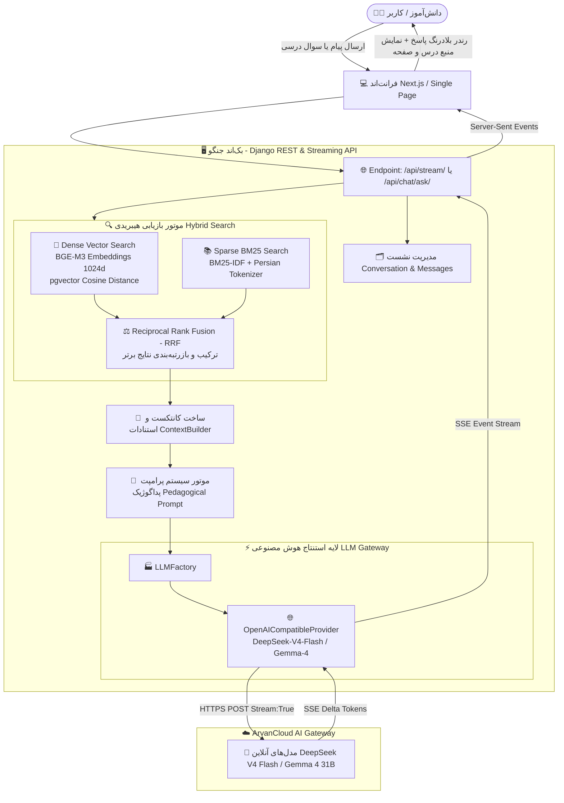
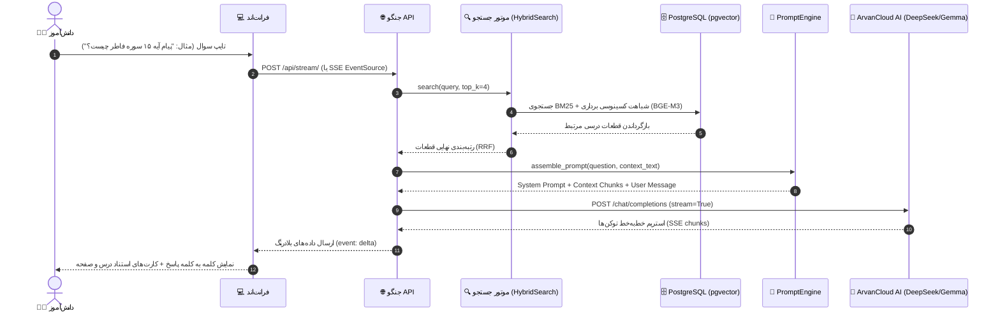

# 🎓 AI High School Tutor (سامانه RAG آموزشی دبیرستان)
> **سامانه تخصصی هوش مصنوعی و بازیابی اطلاعات آموزشی (RAG) منطبق بر کتاب‌های درسی و استانداردهای امتحانات نهایی کشور (پایه دوازدهم)**

---

## 🧭 نقشه راه و دیاگرام جریان داده (End-to-End Data Flow)

جریان پردازش هر پرسش دانش‌آموز از لحظه ارسال در فرانت‌اند تا پاسخ استریم‌شده به صورت زیر انجام می‌پذیرد:



---

## 🔄 جریان دقیق گام‌به‌گام سامانه (Step-by-Step Execution Lifecycle)

### ۱. دریافت پرسش و مدیریت نشست (Request Ingestion & Session Management)
* دانش‌آموز پرسش درسی، شبهه مفهومی یا سوال تستی/تشریحی خود را از طریق فرانت‌اند مدرن ارسال می‌کند.
* کنترلر [`views.py`](file:///f:/ai_rag_high_school/backend/knowledge/views.py) شناسه گفتگوی فعال (`Conversation`) را بازیابی یا ایجاد کرده و پیام کاربر را در پایگاه داده ثبت می‌کند.
* شماره درس هدف به‌صورت خودکار از فیلتر انتخابی یا از طریق آنالیز متن پرسش شناسایی می‌شود.

---

### ۲. موتور جستجوی هیبریدی ترکیبی (Hybrid Retrieval: Dense + Sparse BM25)
برای دستیابی به بالاترین دقت بازیابی متون درسی، فرآیند جستجو به صورت ۲ مسیره موازی در [`hybrid_search.py`](file:///f:/ai_rag_high_school/backend/knowledge/retrieval/hybrid_search.py) اجرا می‌شود:
1. **جستجوی برداری متراکم (Dense Vector Search):**
   * تبدیل سوال به بردار ۱۰۲۴ بعدی با مدل `BAAI/bge-m3`.
   * مقایسه کسینوسی با بردارهای چانک‌های کتاب درسی در پایگاه داده PostgreSQL مجهز به اکستنشن `pgvector`.
2. **جستجوی متنی تنک (Sparse BM25 Search):**
   * توکنایز و نرمال‌سازی فارسی عبارات، حذف کلمات ایستای غیرآموزشی و وزن‌دهی BM25-IDF.
3. **ادغام رتبه‌ها با Reciprocal Rank Fusion (RRF):**
   * ادغام نتایج دو روش جستجو بر اساس فرمول:
     $$RRF(d) = \sum_{m \in \{Dense, BM25\}} \frac{1}{60 + rank_m(d)}$$
   * انتخاب $K$ قطعه با بالاترین امتیاز ارتباط آموزشی.

---

### ۳. استخراج کانتکست و استنادات آموزشی (Context & Citation Extraction)
* کلاس [`ContextBuilder`](file:///f:/ai_rag_high_school/backend/knowledge/retrieval/context_builder.py) قطعات برتر را به همراه متاداده‌های ساختاریافته (شماره درس، عنوان درس، شماره صفحات، شناسه چانک) جمع‌آوری می‌کند.
* فرمت مشخصی از مستندات بازیابی‌شده کتاب درسی تشکیل می‌شود تا مدل بتواند عینا به صفحات کتاب ارجاع دهد.

---

### ۴. موتور سیستم پرامپت پداگوژیک (Pedagogical Prompt Engine)
* ماژول [`pedagogy.py`](file:///f:/ai_rag_high_school/backend/knowledge/ai/pedagogy.py) وظیفه ساخت پرامپت نهایی را بر عهده دارد:
  * **System Prompt:** تعریف پرسونا به عنوان دبیر و متخصص آموزش رسمی کتاب دین و زندگی ۳ پایه دوازدهم.
  * **قوانین پاسخ‌دهی:** التزام ۱۰۰٪ به محتوای بازیابی‌شده کتاب درسی، رعایت ادبیات تصحیح امتحانات نهایی، تفکیک متن و پیام آیات، و پاسخ محترمانه به سلام و مکالمات عمومی.
  * **Context Injection:** تزریق قطعات استخراج‌شده در بخش `محتوای معتبر بازیابی‌شده از کتاب درسی`.

---

### ۵. استنتاج و استریم زنده مدل زبانی (Pure Live LLM & SSE Streaming)
* ماژول [`providers.py`](file:///f:/ai_rag_high_school/backend/knowledge/ai/providers.py) با پروتکل استاندارد `OpenAICompatibleProvider` به گیت‌وی ابری (مانند ArvanCloud AI) متصل است:
  * مدل‌های فعال: **`DeepSeek-V4-Flash`** و **`Gemma-4-31B-IT`**.
  * استریم واقعی و بلادرنگ (Native Server-Sent Events): توکن‌ها به محض تولید توسط هوش مصنوعی از طریق بستر SSE بدون تاخیر به سمت کلاینت پمپاژ می‌شوند.
  * **فاقد هرگونه پاسخ آفلاین یا شبیه‌ساز ساختگی:** کل پاسخ‌ها به‌صورت ۱۰۰٪ زنده از مدل هوش مصنوعی تولید می‌شوند.

---

### ۶. رندر زنده و بازرسی منبع در فرانت‌اند (Real-Time UI & Citations)
* فرانت‌اند داده‌های دریافتی را به صورت توکن‌به‌توکن نمایش می‌دهد.
* ارجاعات رسمی `[درس X، صفحه Y]` به عنوان برچسب‌های تعاملی دراور منبع (Source Inspector) در دسترس دانش‌آموز قرار می‌گیرند.

---

## 📊 دیاگرام توالی تعاملات (Interaction Sequence Diagram)



---

## 🛠️ پشته فناوری (Tech Stack)

| لایه | تکنولوژی‌های به‌کار رفته | وظیفه اصلی |
| :--- | :--- | :--- |
| **Backend** | Python 3.12, Django 5.x, Django REST Framework | هسته مرکزی سامانه، منطق RAG و API |
| **Database & Vector** | PostgreSQL 16+, pgvector extension | پایگاه داده رابطه‌ای و ذخیره‌سازی بردارهای ۱۰۲۴ بعدی |
| **Embeddings** | BAAI/bge-m3 (Dense 1024-dim) | تعبیه‌سازی معنایی متن کتب درسی و پرسش‌ها |
| **Retrieval** | BM25-IDF + Dense Vector Search + RRF | بازیابی ترکیبی کلمات کلیدی و مفاهیم معنایی |
| **LLM Inference** | DeepSeek-V4-Flash / Gemma-4-31B-IT (ArvanCloud Gateway) | استنتاج زنده، تولید محتوای آموزشی و استریم |
| **Frontend** | Next.js / Modern RTL Persian Interface | رابط کاربری چت، بازرس منبع و انتخاب دروس |

---

## 🚀 راهنمای سریع راه‌اندازی و اجرا

### ۱. راه‌اندازی محیط و اجرای بک‌اند جنگو:
```powershell
.\venv\Scripts\python.exe backend/manage.py migrate
.\venv\Scripts\python.exe backend/manage.py runserver 127.0.0.1:8000
```

### ۲. راه‌اندازی فرانت‌اند Next.js:
```bash
cd frontend-next
npm run dev
```
سپس مرورگر را در آدرس `http://localhost:3000` باز کنید.

### ۳. اجرای ارزیابی بنچ‌مارک (Evaluation):
```powershell
.\venv\Scripts\python.exe backend/manage.py run_evaluation
```
(دقت ارزیابی بنچ‌مارک: **Recall@5 = 96.0%** و **MRR = 0.72**)

---
⭐ **توسعه‌یافته به صورت کاملاً فارسی، استاندارد و هماهنگ با اهداف برنامه درسی ملی ایران.**

